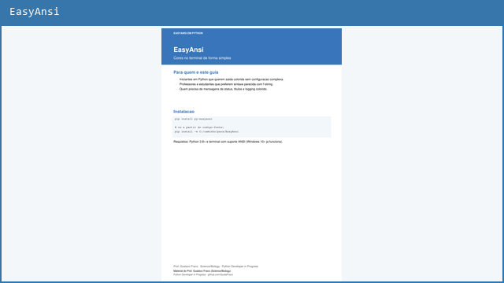

# 04 — Study Materials

Guias em **PDF com texto selecionavel** (alta qualidade para estudo e impressao), criados para organizar conceitos de forma clara durante minha jornada em programacao Python.

[← Voltar ao README principal](../README.md) · [Fundamentos](../01_python_fundamentals/) · [Intermediario](../02_intermediate_advanced/) · [Bibliotecas](../03_python_libraries/)

---

## Materiais de apoio

**Autor:** [Prof. Gustavo Franz](https://github.com/GustaFranz) — Science/Biology | Python Developer in Progress

---

## Guias disponiveis

Clique no card ou no link **PDF** para baixar o arquivo.

<table>
<tr>
<td width="50%" valign="top" align="center">

  
<strong>Git para iniciantes</strong> 
Commits, branches, merge e fluxo de trabalho  
<a href="https://raw.githubusercontent.com/GustaFranz/python_exercises/main/04_study_materials/git/Git_para_iniciantes.pdf" download="Git_para_iniciantes.pdf">PDF</a> · <a href="./git/">Pasta + comandos</a>
</td>
<td width="50%" valign="top" align="center">

  
<strong>Dicionarios em Python</strong> 
Operações, métodos e exercício prático  
<a href="https://raw.githubusercontent.com/GustaFranz/python_exercises/main/04_study_materials/python/Dicionarios_em_Python.pdf" download="Dicionarios_em_Python.pdf">PDF</a> · <a href="./python/">Pasta</a>
</td>
</tr>
<tr>
<td width="50%" valign="top" align="center">

  
<strong>Listas em Python</strong> 
Índices, slice, sort/sorted, set e carrinho de compras  
<a href="https://raw.githubusercontent.com/GustaFranz/python_exercises/main/04_study_materials/python/Listas_em_Python.pdf" download="Listas_em_Python.pdf">PDF</a> · <a href="./python/">Pasta</a>
</td>
<td width="50%" valign="top" align="center">

  
<strong>Tuplas em Python</strong> 
Imutabilidade, fatiamento e médias escolares  
<a href="https://raw.githubusercontent.com/GustaFranz/python_exercises/main/04_study_materials/python/Tuplas_em_Python.pdf" download="Tuplas_em_Python.pdf">PDF</a> · <a href="./python/">Pasta</a>
</td>
</tr>
<tr>
<td width="50%" valign="top" align="center" colspan="2">

  
<strong>Tratamento de Strings em Python</strong> 
Métodos, validações e analisador de frases  
<a href="https://raw.githubusercontent.com/GustaFranz/python_exercises/main/04_study_materials/python/Tratamento_de_Strings_em_Python.pdf" download="Tratamento_de_Strings_em_Python.pdf">PDF</a> · <a href="./python/">Pasta</a>
</td>
</tr>
<tr>
<td width="50%" valign="top" align="center">

  
<strong>EasyAnsi em Python</strong> 
Sintaxe, atalhos, logging e exercício prático  
<a href="https://raw.githubusercontent.com/GustaFranz/python_exercises/main/04_study_materials/easyansi/EasyAnsi_em_Python.pdf" download="EasyAnsi_em_Python.pdf">PDF</a> · <a href="./easyansi/">Pasta</a>
</td>
<td width="50%" valign="top" align="center">

  
<strong>Pathlib e Shutil em Python</strong> 
Caminhos, glob, mkdir, move e integração com automação  
<a href="https://raw.githubusercontent.com/GustaFranz/python_exercises/main/04_study_materials/python/Pathlib_e_Shutil_em_Python.pdf" download="Pathlib_e_Shutil_em_Python.pdf">PDF</a> · <a href="./python/">Pasta</a>
</td>
</tr>
</table>

---

## Indice rapido

| Tema | Material | Acesso |
|------|----------|--------|
| Git | Guia para iniciantes | [PDF](https://raw.githubusercontent.com/GustaFranz/python_exercises/main/04_study_materials/git/Git_para_iniciantes.pdf) · [Pasta](./git/) |
| Python | Dicionarios | [PDF](https://raw.githubusercontent.com/GustaFranz/python_exercises/main/04_study_materials/python/Dicionarios_em_Python.pdf) |
| Python | Listas | [PDF](https://raw.githubusercontent.com/GustaFranz/python_exercises/main/04_study_materials/python/Listas_em_Python.pdf) |
| Python | Tuplas | [PDF](https://raw.githubusercontent.com/GustaFranz/python_exercises/main/04_study_materials/python/Tuplas_em_Python.pdf) |
| Python | Tratamento de Strings | [PDF](https://raw.githubusercontent.com/GustaFranz/python_exercises/main/04_study_materials/python/Tratamento_de_Strings_em_Python.pdf) |
| Python | EasyAnsi | [PDF](https://raw.githubusercontent.com/GustaFranz/python_exercises/main/04_study_materials/easyansi/EasyAnsi_em_Python.pdf) · [Pasta](./easyansi/) |
| Python | Pathlib e Shutil | [PDF](https://raw.githubusercontent.com/GustaFranz/python_exercises/main/04_study_materials/python/Pathlib_e_Shutil_em_Python.pdf) |

---

## Outros projetos

<table>
<tr>
<td width="50%" align="center">

</td>
<td width="50%" align="center">

</td>
</tr>
</table>

[Voltar ao README principal](../README.md)
