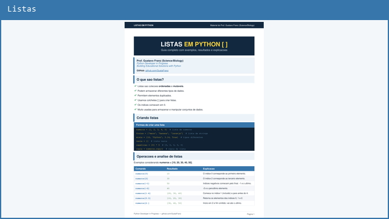
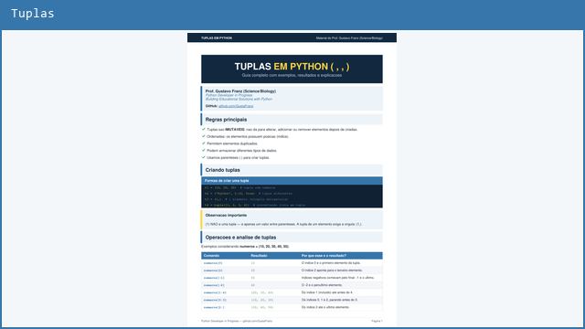
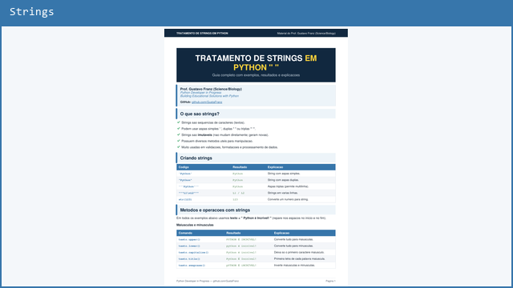
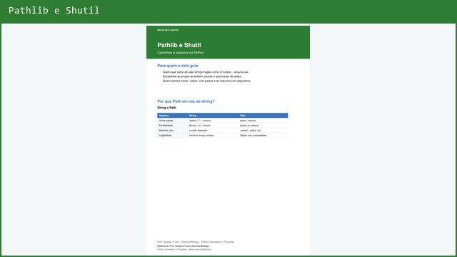

# Guias Python — estruturas de dados e strings

Materiais didáticos em PDF: exemplos, tabelas de comandos, exercícios práticos e boas práticas.

Cada PDF foi produzido com **texto vetorial** (nítido em qualquer zoom), pensado para estudo autônomo, revisão rápida e apoio aos [exercícios do repositório](../README.md).

---

## Downloads

<table>
<tr>
<td width="50%" valign="top" align="center">
<a href="https://raw.githubusercontent.com/GustaFranz/python_exercises/main/04_study_materials/python/Dicionarios_em_Python.pdf" download="Dicionarios_em_Python.pdf">

</a>
<br><br>
<strong>Dicionarios em Python</strong><br>
<sub>Criação, .get(), métodos, aninhamento, iteração</sub><br><br>
<a href="https://raw.githubusercontent.com/GustaFranz/python_exercises/main/04_study_materials/python/Dicionarios_em_Python.pdf" download="Dicionarios_em_Python.pdf">Baixar PDF</a>
</td>
<td width="50%" valign="top" align="center">
<a href="https://raw.githubusercontent.com/GustaFranz/python_exercises/main/04_study_materials/python/Listas_em_Python.pdf" download="Listas_em_Python.pdf">

</a>
<br><br>
<strong>Listas em Python</strong><br>
<sub>Índices, fatiamento, sort/sorted, set, carrinho</sub><br><br>
<a href="https://raw.githubusercontent.com/GustaFranz/python_exercises/main/04_study_materials/python/Listas_em_Python.pdf" download="Listas_em_Python.pdf">Baixar PDF</a>
</td>
</tr>
<tr>
<td width="50%" valign="top" align="center">
<a href="https://raw.githubusercontent.com/GustaFranz/python_exercises/main/04_study_materials/python/Tuplas_em_Python.pdf" download="Tuplas_em_Python.pdf">

</a>
<br><br>
<strong>Tuplas em Python</strong><br>
<sub>Imutabilidade, operações, fatiamento, médias escolares</sub><br><br>
<a href="https://raw.githubusercontent.com/GustaFranz/python_exercises/main/04_study_materials/python/Tuplas_em_Python.pdf" download="Tuplas_em_Python.pdf">Baixar PDF</a>
</td>
<td width="50%" valign="top" align="center">
<a href="https://raw.githubusercontent.com/GustaFranz/python_exercises/main/04_study_materials/python/Tratamento_de_Strings_em_Python.pdf" download="Tratamento_de_Strings_em_Python.pdf">

</a>
<br><br>
<strong>Tratamento de Strings</strong><br>
<sub>Métodos de manipulação, verificações, analisador de frases</sub><br><br>
<a href="https://raw.githubusercontent.com/GustaFranz/python_exercises/main/04_study_materials/python/Tratamento_de_Strings_em_Python.pdf" download="Tratamento_de_Strings_em_Python.pdf">Baixar PDF</a>
</td>
</tr>
<tr>
<td width="50%" valign="top" align="center">
<a href="https://raw.githubusercontent.com/GustaFranz/python_exercises/main/04_study_materials/python/Pathlib_e_Shutil_em_Python.pdf" download="Pathlib_e_Shutil_em_Python.pdf">

</a>
<br><br>
<strong>Pathlib e Shutil</strong><br>
<sub>Caminhos, glob, mkdir, read/write, move e integração</sub><br><br>
<a href="https://raw.githubusercontent.com/GustaFranz/python_exercises/main/04_study_materials/python/Pathlib_e_Shutil_em_Python.pdf" download="Pathlib_e_Shutil_em_Python.pdf">Baixar PDF</a>
</td>
<td width="50%" valign="top" align="center">
&nbsp;
</td>
</tr>
</table>

---

## O que cada guia cobre

| Guia | Conteúdo principal |
|------|-------------------|
| **Dicionarios** | Criação, `.get()`, métodos, aninhamento, iteração, exercício de biblioteca |
| **Listas** | Índices, fatiamento, métodos, `sort()` x `sorted()`, `set()`, slice visual, exercício de carrinho de compras |
| **Tuplas** | Imutabilidade, operações, fatiamento, exercício de médias escolares |
| **Strings** | Métodos de manipulação, verificações, exercício analisador de frases |
| **Pathlib e Shutil** | Path, operador `/`, glob, mkdir, read/write, shutil.move, integração com automação |

### Gerar o PDF Pathlib e Shutil

```bash
python 04_study_materials/python/_gerar_pathlib_shutil_pdf.py
```

---

## Sobre o autor

**Prof. Gustavo Franz (Science/Biology)** — professor de Ciências e Biologia desde 2013, atualmente estudando programação e construindo soluções educacionais com Python.

- GitHub: [github.com/GustaFranz](https://github.com/GustaFranz)
- Exercícios resolvidos: [python_exercises](https://github.com/GustaFranz/python_exercises)
- Projeto open source: [easyansi](https://github.com/GustaFranz/easyansi)

[Voltar aos materiais](../README.md) · [README principal](../../README.md)
