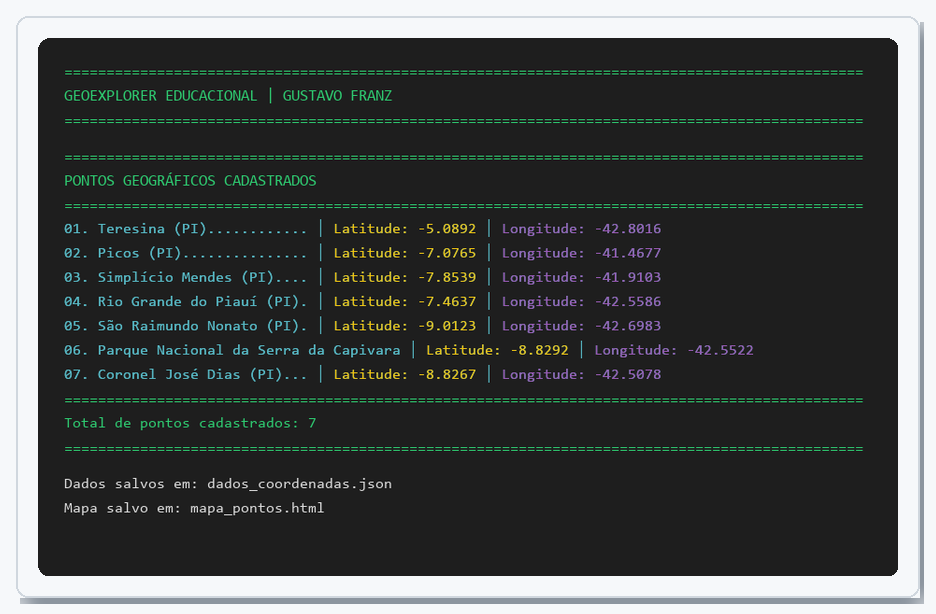
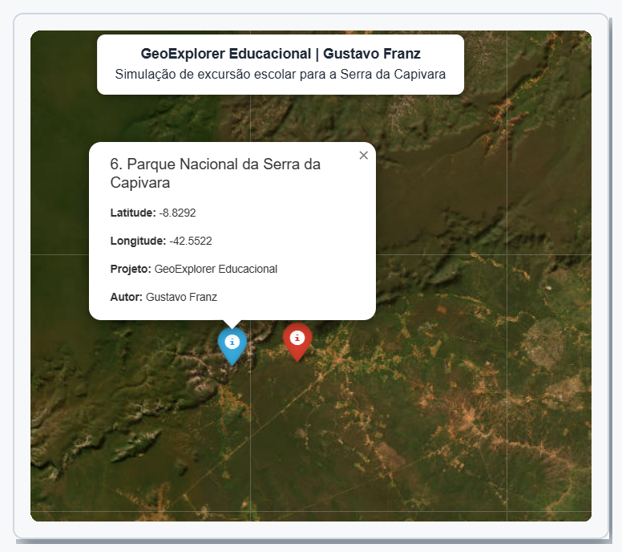

<p align="center">
  
</p>

<p align="center">
  <a href="https://www.python.org/"></a>
  <a href="https://git-scm.com/"></a>
  
  
  <a href="./LICENSE"></a>
</p>

<p align="center">
  <strong>Prof. Gustavo Franz (Science/Biology)</strong> · Python Developer in Progress · Building Educational Solutions with Python<br>
  <a href="https://github.com/GustaFranz">github.com/GustaFranz</a>
</p>

---

## Por que olhar este repositorio?

Sou professor de **Ciencias e Biologia desde 2013**. Hoje estou em transicao para a area de tecnologia, estudando programacao de forma **estruturada, consistente e publica**.

Este repositorio nao e so uma lista de scripts: e um **portfolio de evolucao** — do primeiro `print` ate projetos com estruturas de dados, validacao, modulos e integracao com APIs. Cada exercicio tem pasta propria, README e codigo executavel.

**Em uma frase:** alguem que ja ensina, aprende com metodo e compartilha o caminho para ajudar outros.

---

## Destaques

<table>
<tr>
<td width="25%" align="center" valign="top">
<br><br>
<strong>Progressivos</strong><br>
<sub>Do basico ao avancado, numerados e documentados</sub>
</td>
<td width="25%" align="center" valign="top">
<br><br>
<strong>Materiais de apoio</strong><br>
<sub>Texto nitido, pronto para estudo e impressao</sub>
</td>
<td width="25%" align="center" valign="top">
<br><br>
<strong>Organizacao</strong><br>
<sub>Pastas <code>NN_snake_case</code>, README por exercicio</sub>
</td>
<td width="25%" align="center" valign="top">
<br><br>
<strong>Projeto publicado</strong><br>
<sub><a href="https://github.com/GustaFranz/easyansi">Biblioteca para cores no terminal</a></sub>
</td>
</tr>
</table>

---

## Atividades em Destaque

Projeto integrando Python, dados geograficos e visualizacao interativa — simulacao de excursao escolar pela Serra da Capivara (PI).

<table>
<tr>
<td colspan="3" align="center" valign="top">
<strong>49 — GeoExplorer Educacional</strong><br>
<sub>Cadastro de pontos com latitude e longitude, exportacao em JSON e mapa HTML com Folium</sub><br><br>
<a href="./49_registro_coordenadas_campo/">Abrir exercicio</a> · <a href="./49_registro_coordenadas_campo/mapa_pontos.html">Ver mapa interativo</a>
</td>
</tr>
<tr>
<td width="33%" valign="top" align="center">
<a href="./49_registro_coordenadas_campo/">

</a>
<br><br>
<strong>Relatorio</strong><br>
<sub>Lista formatada no terminal</sub>
</td>
<td width="33%" valign="top" align="center">
<a href="./49_registro_coordenadas_campo/">

</a>
<br><br>
<strong>Mapa geral</strong><br>
<sub>Sete cidades e pontos no Piaui</sub>
</td>
<td width="33%" valign="top" align="center">
<a href="./49_registro_coordenadas_campo/">

</a>
<br><br>
<strong>Detalhe do ponto</strong><br>
<sub>Popup ao clicar no marcador</sub>
</td>
</tr>
</table>

---

## Materiais de apoio (PDF)

Guias criados durante meus estudos — compartilhados para quem esta comecando. **Clique no card para abrir o PDF.**

<table>
<tr>
<td width="50%" valign="top" align="center">
<a href="./materiais/git/Git_para_iniciantes.pdf">

</a>
<br><br>
<strong>Git para iniciantes</strong><br>
<sub>Commits, branches, merge e fluxo de trabalho</sub><br><br>
<a href="./materiais/git/Git_para_iniciantes.pdf">Baixar PDF</a> · <a href="./materiais/git/">Ver pasta</a>
</td>
<td width="50%" valign="top" align="center">
<a href="./materiais/python/Dicionarios_em_Python.pdf">

</a>
<br><br>
<strong>Dicionarios em Python</strong><br>
<sub>Operacoes, metodos e exercicio pratico</sub><br><br>
<a href="./materiais/python/Dicionarios_em_Python.pdf">Baixar PDF</a> · <a href="./materiais/python/">Ver pasta</a>
</td>
</tr>
<tr>
<td width="50%" valign="top" align="center">
<a href="./materiais/python/Listas_em_Python.pdf">

</a>
<br><br>
<strong>Listas em Python</strong><br>
<sub>Indices, slice, metodos e carrinho de compras</sub><br><br>
<a href="./materiais/python/Listas_em_Python.pdf">Baixar PDF</a>
</td>
<td width="50%" valign="top" align="center">
<a href="./materiais/python/Tuplas_em_Python.pdf">

</a>
<br><br>
<strong>Tuplas em Python</strong><br>
<sub>Imutabilidade, fatiamento e medias escolares</sub><br><br>
<a href="./materiais/python/Tuplas_em_Python.pdf">Baixar PDF</a>
</td>
</tr>
<tr>
<td width="50%" valign="top" align="center" colspan="2">
<a href="./materiais/python/Tratamento_de_Strings_em_Python.pdf">

</a>
<br><br>
<strong>Tratamento de Strings em Python</strong><br>
<sub>Metodos, validacoes e analisador de frases</sub><br><br>
<a href="./materiais/python/Tratamento_de_Strings_em_Python.pdf">Baixar PDF</a> · <a href="./materiais/">Indice completo dos materiais</a>
</td>
</tr>
</table>

---

## Competencias demonstradas

<table>
<tr>
<td width="33%" valign="top">

**Python**
- Tipos, strings, condicionais, loops
- Funcoes, listas, tuplas, dicionarios

</td>
<td width="33%" valign="top">

**Logica e organizacao**
- Problemas do mundo real (IMC, conversores, sorteios)
- Projetos modulares, validacao, menus interativos

</td>
<td width="33%" valign="top">

**Git e comunicacao**
- Versionamento, branches, fluxo colaborativo
- Documentacao clara — perfil de quem veio da educacao

</td>
</tr>
</table>

---

## Como executar

```bash
git clone https://github.com/GustaFranz/exercicios_python.git
cd exercicios_python/04_funcao_format
python main.py
```

1. Clone o repositorio
2. Entre na pasta do exercicio desejado
3. Execute o script com Python 3

---

## Navegacao dos exercicios

<details open>
<summary><strong>Fundamentos (01-04)</strong></summary>

| # | Exercicio | Link |
|---|-----------|------|
| 01 | Meu primeiro codigo | [Abrir](./01_meu_primeiro_codigo/) |
| 02 | Soma de dois numeros | [Abrir](./02_soma_de_dois_numeros/) |
| 03 | Comandos de decisao | [Abrir](./03_comandos_de_decisao/) |
| 04 | Funcao format | [Abrir](./04_funcao_format/) |

</details>

<details>
<summary><strong>Strings e numeros basicos (05-07)</strong></summary>

| # | Exercicio | Link |
|---|-----------|------|
| 05 | Strings maiusculas | [Abrir](./05_strings_maiusculas/) |
| 06 | Strings minuscula | [Abrir](./06_strings_minuscula/) |
| 07 | Antecessor e sucessor | [Abrir](./07_antecessor_sucessor/) |

</details>

<details>
<summary><strong>Conversoes e unidades (08-13)</strong></summary>

| # | Exercicio | Link |
|---|-----------|------|
| 08 | Conversao do sistema metrico decimal | [Abrir](./08_conversao_sistema_metrico_decimal/) |
| 09 | Conversao de volume em litros | [Abrir](./09_conversao_unidades_volume_litros/) |
| 10 | Capacidade em litros | [Abrir](./10_capacidade_em_litros/) |
| 11 | Converter Celsius para Kelvin | [Abrir](./11_converter_celsius_kelvin/) |
| 12 | Converter Fahrenheit para Kelvin | [Abrir](./12_converter_fahrenheit_kelvin/) |
| 13 | Converter Celsius para Fahrenheit | [Abrir](./13_converter_celsius_fahrenheit/) |

</details>

<details>
<summary><strong>Matematica e geometria (14-20)</strong></summary>

| # | Exercicio | Link |
|---|-----------|------|
| 14 | Permissao de passagem de veiculos | [Abrir](./14_permissao_passagem_veiculos/) |
| 15 | Aluguel de carros | [Abrir](./15_aluguel_carros/) |
| 16 | Parte inteira de numero real | [Abrir](./16_parte_inteira_num_real/) |
| 17 | Hipotenusa do triangulo | [Abrir](./17_hipotenusa_triangulo/) |
| 18 | Seno, cosseno e tangente | [Abrir](./18_sen_cos_tan/) |
| 19 | Area e perimetro | [Abrir](./19_area_e_perimetro/) |
| 20 | Calculadora de IMC | [Abrir](./20_calculadora_imc/) |

</details>

<details>
<summary><strong>Random, strings e jogos (21-29)</strong></summary>

| # | Exercicio | Link |
|---|-----------|------|
| 21 | Sorteio de um aluno | [Abrir](./21_sorteio_um_aluno/) |
| 22 | Sorteio da ordem de apresentacao | [Abrir](./22_sorteio_ordem_apresentacao/) |
| 23 | Analisador de textos | [Abrir](./23_analisador_textos/) |
| 24 | Separador de digitos | [Abrir](./24_separador_digitos/) |
| 25 | Nome da cidade | [Abrir](./25_nome_cidade/) |
| 26 | Contem Silva | [Abrir](./26_contem_silva/) |
| 27 | Analisador de frase | [Abrir](./27_analisador_frase/) |
| 28 | Primeiro e ultimo nome | [Abrir](./28_primeiro_e_ultimo_nome/) |
| 29 | Advinhe o numero | [Abrir](./29_advinhe_o_numero/) |

</details>

<details>
<summary><strong>Condicionais avancadas (30-36)</strong></summary>

| # | Exercicio | Link |
|---|-----------|------|
| 30 | Controle de velocidade | [Abrir](./30_controle_velocidade/) |
| 31 | Par ou impar | [Abrir](./31_par_ou_impar/) |
| 32 | Calculo do preco da passagem | [Abrir](./32_calculo_preco_passagem/) |
| 33 | Ano bissexto | [Abrir](./33_ano_bissexto/) |
| 34 | Maior e menor numero | [Abrir](./34_maior_e_menor_num/) |
| 35 | Aumento salarial | [Abrir](./35_aumento_salarial/) |
| 36 | Condicao de existencia do triangulo | [Abrir](./36_condicao_existencia_triangulo/) |

</details>

<details>
<summary><strong>Estruturas de dados e sistemas (37-50)</strong></summary>

| # | Exercicio | Link |
|---|-----------|------|
| 37 | Sistema de medias da turma | [Abrir](./37_sistema_medias_turma/) |
| 38 | Analisador de gastos mensais | [Abrir](./38_analisador_gastos_mensais/) |
| 39 | Tabuada inteligente | [Abrir](./39_tabuada_inteligente/) |
| 40 | Classificador de palavras | [Abrir](./40_classificador_palavras/) |
| 41 | Simulador de presenca escolar | [Abrir](./41_simulador_presenca_escolar/) |
| 42 | Sistema de frequencia com relatorio | [Abrir](./42_sistema_frequencia_com_validacao_e_relatorio/) |
| 43 | Cadastro de alunos | [Abrir](./43_cadastro_alunos_parada_manual/) |
| 44 | Simulador de caixa de supermercado | [Abrir](./44_simulador_caixa_supermercado/) |
| 45 | Monitor de temperatura com alerta | [Abrir](./45_monitor_temperatura_alerta/) |
| 46 | Controle de acesso com bloqueio | [Abrir](./46_controle_acesso_bloqueio/) |
| 47 | Sistema de comandos no console | [Abrir](./47_sistema_comandos_console/) |
| 48 | Registro de disciplinas | [Abrir](./48_registro_disciplinas/) |
| 49 | Registro de coordenadas de campo | [Abrir](./49_registro_coordenadas_campo/) |
| 50 | Ranking imutavel de alunos | [Abrir](./50_ranking_imutavel_alunos/) |

</details>

---

## Outros projetos

<table>
<tr>
<td width="50%" valign="top" align="center">
<a href="https://github.com/GustaFranz/easyansi">

</a>
<br><br>
<strong>EasyAnsi</strong><br>
<sub>Formatacao colorida no terminal — zero dependencias, docs em 4 idiomas</sub>
</td>
<td width="50%" valign="top" align="center">
<a href="https://github.com/GustaFranz/exercicios_python">

</a>
<br><br>
<strong>exercicios_python</strong><br>
<sub>Portfolio de evolucao com exercicios documentados e materiais PDF</sub>
</td>
</tr>
</table>

---

## Convencoes

| Onde | Regra |
|------|-------|
| **Pastas** | `NN_snake_case` — numero + nome sem espacos e sem acentos |
| **READMEs** | Titulos sem acentos, para links simples |
| **Codigo Python** | Mensagens ao usuario podem usar acentos; comentarios seguem PEP 8 |
| **Secoes** | `Objetivo`, `Enunciado` e `Como executar` em cada exercicio |

---

## Estrutura do repositorio

```
exercicios_python/
├── LICENSE
├── README.md
├── NN_nome_exercicio/
│   ├── README.md
│   └── main.py
└── materiais/
    ├── README.md
    ├── assets/          # banner e cards (previews dos PDFs)
    ├── git/
    └── python/
```

---

## Contribuicao

Sugestoes sao bem-vindas! Abra uma [issue](https://github.com/GustaFranz/exercicios_python/issues) ou envie um Pull Request.

---

<p align="center">
  <em>Quem estuda com perseveranca e confia em Deus, sempre vence!</em><br>
  <strong>Prof. Gustavo Franz</strong>
</p>
