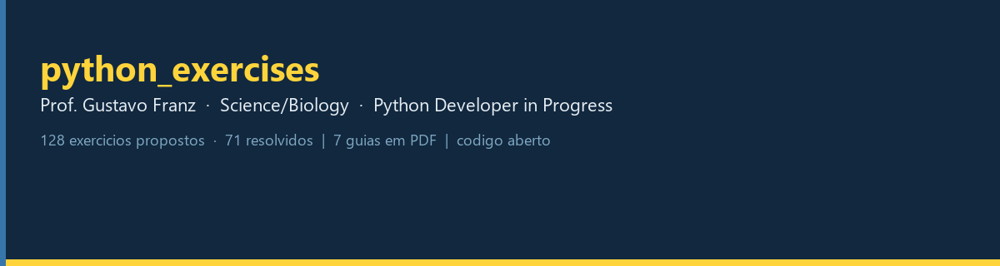
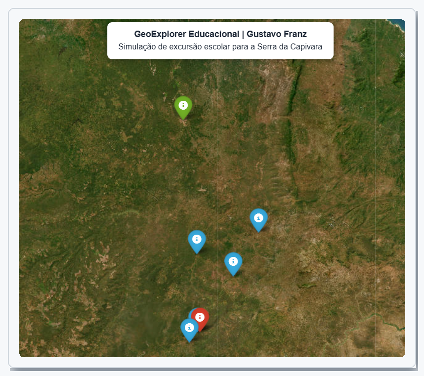
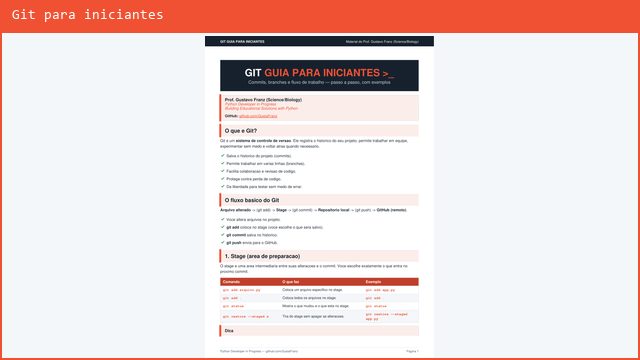
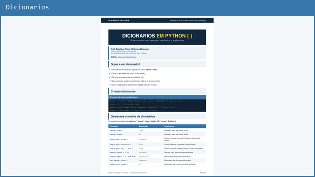
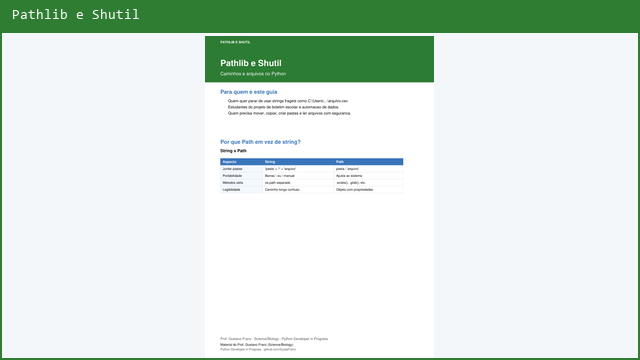

<p align="center">
  
</p>

<p align="center">
  <a href="https://www.python.org/"></a>
  <a href="https://git-scm.com/"></a>
  
  
  <a href="./LICENSE"></a>
</p>

<p align="center">
  <strong>Prof. Gustavo Franz (Science/Biology)</strong> · Python Developer in Progress · Building Educational Solutions with Python<br>
  <a href="https://github.com/GustaFranz">github.com/GustaFranz</a>
</p>

---

## Por que olhar este repositorio?

Sou professor de **Ciencias e Biologia desde 2013**. Hoje estou em transicao para a area de tecnologia, estudando programacao de forma **estruturada, consistente e publica**.

Este repositorio nao e so uma lista de scripts: e um **portfolio de evolucao** — do primeiro `print` ate projetos com estruturas de dados, validacao, modulos e integracao com APIs. Cada exercicio tem pasta propria, README e codigo executavel.

**Em uma frase:** alguem que ja ensina, aprende com metodo e compartilha o caminho para ajudar outros.

> Este repositório faz parte do meu processo de aprendizado em Python. Uso ferramentas de IA como apoio para revisão, edição de layouts dos materiais e tirar dúvidas, mas todos os códigos são estudados e escritos por mim.

---

## Destaques

<table>
<tr>
<td width="25%" align="center" valign="top">
<a href="#navegacao-dos-exercicios"></a> <a href="#navegacao-dos-exercicios"></a><br><br>
<strong>Progressivos</strong><br>
<sub>Do basico ao avancado, numerados e documentados</sub>
</td>
<td width="25%" align="center" valign="top">
<a href="#materiais-de-apoio-pdf"></a><br><br>
<strong>Materiais de apoio</strong><br>
<sub>Texto nitido, pronto para estudo e impressao</sub>
</td>
<td width="25%" align="center" valign="top">
<a href="#convencoes"></a><br><br>
<strong>Organizacao</strong><br>
<sub>Pastas <code>NN_snake_case</code>, README por exercicio</sub>
</td>
<td width="25%" align="center" valign="top">
<a href="https://github.com/GustaFranz/easyansi"></a><br><br>
<strong>Projeto publicado</strong><br>
<sub><a href="https://github.com/GustaFranz/easyansi">Biblioteca para cores no terminal</a></sub>
</td>
</tr>
</table>

---

## Atividades em Destaque

Projeto integrando Python, dados geograficos e visualizacao interativa — simulacao de excursao escolar pela Serra da Capivara (PI).

<table>
<tr>
<td colspan="3" align="center" valign="top">
<strong>49 — GeoExplorer Educacional</strong><br>
<sub>Cadastro de pontos com latitude e longitude, exportacao em JSON e mapa HTML com Folium</sub><br><br>
<a href="./01_python_fundamentals/49_registro_coordenadas_campo/">Abrir exercicio</a> · <a href="./01_python_fundamentals/49_registro_coordenadas_campo/mapa_pontos.html">Ver mapa interativo</a>
</td>
</tr>
<tr>
<td width="33%" valign="top" align="center">
<a href="./01_python_fundamentals/49_registro_coordenadas_campo/">

</a>
<br><br>
<strong>Relatorio</strong><br>
<sub>Lista formatada no terminal</sub>
</td>
<td width="33%" valign="top" align="center">
<a href="./01_python_fundamentals/49_registro_coordenadas_campo/">

</a>
<br><br>
<strong>Mapa geral</strong><br>
<sub>Sete cidades e pontos no Piaui</sub>
</td>
<td width="33%" valign="top" align="center">
<a href="./01_python_fundamentals/49_registro_coordenadas_campo/">

</a>
<br><br>
<strong>Detalhe do ponto</strong><br>
<sub>Popup ao clicar no marcador</sub>
</td>
</tr>
</table>

---

## Materiais de apoio (PDF)

Guias criados durante meus estudos — compartilhados para quem esta comecando. **Clique no card ou em Baixar PDF para fazer o download.**

<table>
<tr>
<td width="50%" valign="top" align="center">
<a href="https://raw.githubusercontent.com/GustaFranz/python_exercises/main/materiais/git/Git_para_iniciantes.pdf" download="Git_para_iniciantes.pdf">

</a>
<br><br>
<strong>Git para iniciantes</strong><br>
<sub>Commits, branches, merge e fluxo de trabalho</sub><br><br>
<a href="https://raw.githubusercontent.com/GustaFranz/python_exercises/main/materiais/git/Git_para_iniciantes.pdf" download="Git_para_iniciantes.pdf">Baixar PDF</a> · <a href="./materiais/git/">Ver pasta</a>
</td>
<td width="50%" valign="top" align="center">
<a href="https://raw.githubusercontent.com/GustaFranz/python_exercises/main/materiais/python/Dicionarios_em_Python.pdf" download="Dicionarios_em_Python.pdf">

</a>
<br><br>
<strong>Dicionarios em Python</strong><br>
<sub>Operacoes, metodos e exercicio pratico</sub><br><br>
<a href="https://raw.githubusercontent.com/GustaFranz/python_exercises/main/materiais/python/Dicionarios_em_Python.pdf" download="Dicionarios_em_Python.pdf">Baixar PDF</a> · <a href="./materiais/python/">Ver pasta</a>
</td>
</tr>
<tr>
<td width="50%" valign="top" align="center">
<a href="https://raw.githubusercontent.com/GustaFranz/python_exercises/main/materiais/python/Listas_em_Python.pdf" download="Listas_em_Python.pdf">

</a>
<br><br>
<strong>Listas em Python</strong><br>
<sub>Indices, slice, sort/sorted, set e carrinho de compras</sub><br><br>
<a href="https://raw.githubusercontent.com/GustaFranz/python_exercises/main/materiais/python/Listas_em_Python.pdf" download="Listas_em_Python.pdf">Baixar PDF</a>
</td>
<td width="50%" valign="top" align="center">
<a href="https://raw.githubusercontent.com/GustaFranz/python_exercises/main/materiais/python/Tuplas_em_Python.pdf" download="Tuplas_em_Python.pdf">

</a>
<br><br>
<strong>Tuplas em Python</strong><br>
<sub>Imutabilidade, fatiamento e medias escolares</sub><br><br>
<a href="https://raw.githubusercontent.com/GustaFranz/python_exercises/main/materiais/python/Tuplas_em_Python.pdf" download="Tuplas_em_Python.pdf">Baixar PDF</a>
</td>
</tr>
<tr>
<td width="50%" valign="top" align="center" colspan="2">
<a href="https://raw.githubusercontent.com/GustaFranz/python_exercises/main/materiais/python/Tratamento_de_Strings_em_Python.pdf" download="Tratamento_de_Strings_em_Python.pdf">

</a>
<br><br>
<strong>Tratamento de Strings em Python</strong><br>
<sub>Metodos, validacoes e analisador de frases</sub><br><br>
<a href="https://raw.githubusercontent.com/GustaFranz/python_exercises/main/materiais/python/Tratamento_de_Strings_em_Python.pdf" download="Tratamento_de_Strings_em_Python.pdf">Baixar PDF</a>
</td>
</tr>
<tr>
<td width="50%" valign="top" align="center">
<a href="https://raw.githubusercontent.com/GustaFranz/python_exercises/main/materiais/easyansi/EasyAnsi_em_Python.pdf" download="EasyAnsi_em_Python.pdf">

</a>
<br><br>
<strong>EasyAnsi em Python</strong><br>
<sub>Sintaxe, atalhos, logging e exercicio pratico</sub><br><br>
<a href="https://raw.githubusercontent.com/GustaFranz/python_exercises/main/materiais/easyansi/EasyAnsi_em_Python.pdf" download="EasyAnsi_em_Python.pdf">Baixar PDF</a> · <a href="./materiais/easyansi/">Ver pasta</a>
</td>
<td width="50%" valign="top" align="center">
<a href="https://raw.githubusercontent.com/GustaFranz/python_exercises/main/materiais/python/Pathlib_e_Shutil_em_Python.pdf" download="Pathlib_e_Shutil_em_Python.pdf">

</a>
<br><br>
<strong>Pathlib e Shutil em Python</strong><br>
<sub>Caminhos, glob, mkdir, move e integracao com automacao</sub><br><br>
<a href="https://raw.githubusercontent.com/GustaFranz/python_exercises/main/materiais/python/Pathlib_e_Shutil_em_Python.pdf" download="Pathlib_e_Shutil_em_Python.pdf">Baixar PDF</a> · <a href="./materiais/">Indice completo dos materiais</a>
</td>
</tr>
</table>

---

## Competencias demonstradas

<table>
<tr>
<td width="33%" valign="top">

**Python**
- Tipos, strings, condicionais, loops
- Funcoes, listas, tuplas, dicionarios

</td>
<td width="33%" valign="top">

**Logica e organizacao**
- Problemas do mundo real (IMC, conversores, sorteios)
- Projetos modulares, validacao, menus interativos

</td>
<td width="33%" valign="top">

**Git e comunicacao**
- Versionamento, branches, fluxo colaborativo
- Documentacao clara — perfil de quem veio da educacao

</td>
</tr>
</table>

---

## Como executar

```bash
git clone https://github.com/GustaFranz/python_exercises.git
cd python_exercises/01_python_fundamentals/04_funcao_format
python main.py
```

1. Clone o repositorio
2. Entre na pasta do exercicio desejado
3. Execute o script com Python 3

---

## Navegacao dos exercicios

Indice completo em **[01_python_fundamentals](./01_python_fundamentals/)** (fundamentos) e **[02_intermediate_advanced](./02_intermediate_advanced/)** (intermediario — em construcao).

<details open>
<summary><strong>Fundamentos (01-04)</strong></summary>

| # | Exercicio | Link |
|---|-----------|------|
| 01 | Meu primeiro codigo | [Abrir](./01_python_fundamentals/01_meu_primeiro_codigo/) |
| 02 | Soma de dois numeros | [Abrir](./01_python_fundamentals/02_soma_de_dois_numeros/) |
| 03 | Comandos de decisao | [Abrir](./01_python_fundamentals/03_comandos_de_decisao/) |
| 04 | Funcao format | [Abrir](./01_python_fundamentals/04_funcao_format/) |

</details>

<details>
<summary><strong>Strings e numeros basicos (05-07)</strong></summary>

| # | Exercicio | Link |
|---|-----------|------|
| 05 | Strings maiusculas | [Abrir](./01_python_fundamentals/05_strings_maiusculas/) |
| 06 | Strings minuscula | [Abrir](./01_python_fundamentals/06_strings_minuscula/) |
| 07 | Antecessor e sucessor | [Abrir](./01_python_fundamentals/07_antecessor_sucessor/) |

</details>

<details>
<summary><strong>Conversoes e unidades (08-13)</strong></summary>

| # | Exercicio | Link |
|---|-----------|------|
| 08 | Conversao do sistema metrico decimal | [Abrir](./01_python_fundamentals/08_conversao_sistema_metrico_decimal/) |
| 09 | Conversao de volume em litros | [Abrir](./01_python_fundamentals/09_conversao_unidades_volume_litros/) |
| 10 | Capacidade em litros | [Abrir](./01_python_fundamentals/10_capacidade_em_litros/) |
| 11 | Converter Celsius para Kelvin | [Abrir](./01_python_fundamentals/11_converter_celsius_kelvin/) |
| 12 | Converter Fahrenheit para Kelvin | [Abrir](./01_python_fundamentals/12_converter_fahrenheit_kelvin/) |
| 13 | Converter Celsius para Fahrenheit | [Abrir](./01_python_fundamentals/13_converter_celsius_fahrenheit/) |

</details>

<details>
<summary><strong>Matematica e geometria (14-20)</strong></summary>

| # | Exercicio | Link |
|---|-----------|------|
| 14 | Permissao de passagem de veiculos | [Abrir](./01_python_fundamentals/14_permissao_passagem_veiculos/) |
| 15 | Aluguel de carros | [Abrir](./01_python_fundamentals/15_aluguel_carros/) |
| 16 | Parte inteira de numero real | [Abrir](./01_python_fundamentals/16_parte_inteira_num_real/) |
| 17 | Hipotenusa do triangulo | [Abrir](./01_python_fundamentals/17_hipotenusa_triangulo/) |
| 18 | Seno, cosseno e tangente | [Abrir](./01_python_fundamentals/18_sen_cos_tan/) |
| 19 | Area e perimetro | [Abrir](./01_python_fundamentals/19_area_e_perimetro/) |
| 20 | Calculadora de IMC | [Abrir](./01_python_fundamentals/20_calculadora_imc/) |

</details>

<details>
<summary><strong>Random, strings e jogos (21-29)</strong></summary>

| # | Exercicio | Link |
|---|-----------|------|
| 21 | Sorteio de um aluno | [Abrir](./01_python_fundamentals/21_sorteio_um_aluno/) |
| 22 | Sorteio da ordem de apresentacao | [Abrir](./01_python_fundamentals/22_sorteio_ordem_apresentacao/) |
| 23 | Analisador de textos | [Abrir](./01_python_fundamentals/23_analisador_textos/) |
| 24 | Separador de digitos | [Abrir](./01_python_fundamentals/24_separador_digitos/) |
| 25 | Nome da cidade | [Abrir](./01_python_fundamentals/25_nome_cidade/) |
| 26 | Contem Silva | [Abrir](./01_python_fundamentals/26_contem_silva/) |
| 27 | Analisador de frase | [Abrir](./01_python_fundamentals/27_analisador_frase/) |
| 28 | Primeiro e ultimo nome | [Abrir](./01_python_fundamentals/28_primeiro_e_ultimo_nome/) |
| 29 | Advinhe o numero | [Abrir](./01_python_fundamentals/29_advinhe_o_numero/) |

</details>

<details>
<summary><strong>Condicionais avancadas (30-36)</strong></summary>

| # | Exercicio | Link |
|---|-----------|------|
| 30 | Controle de velocidade | [Abrir](./01_python_fundamentals/30_controle_velocidade/) |
| 31 | Par ou impar | [Abrir](./01_python_fundamentals/31_par_ou_impar/) |
| 32 | Calculo do preco da passagem | [Abrir](./01_python_fundamentals/32_calculo_preco_passagem/) |
| 33 | Ano bissexto | [Abrir](./01_python_fundamentals/33_ano_bissexto/) |
| 34 | Maior e menor numero | [Abrir](./01_python_fundamentals/34_maior_e_menor_num/) |
| 35 | Aumento salarial | [Abrir](./01_python_fundamentals/35_aumento_salarial/) |
| 36 | Condicao de existencia do triangulo | [Abrir](./01_python_fundamentals/36_condicao_existencia_triangulo/) |

</details>

<details>
<summary><strong>Estruturas de dados e sistemas (37-50)</strong></summary>

| # | Exercicio | Link |
|---|-----------|------|
| 37 | Sistema de medias da turma | [Abrir](./01_python_fundamentals/37_sistema_medias_turma/) |
| 38 | Analisador de gastos mensais | [Abrir](./01_python_fundamentals/38_analisador_gastos_mensais/) |
| 39 | Tabuada inteligente | [Abrir](./01_python_fundamentals/39_tabuada_inteligente/) |
| 40 | Classificador de palavras | [Abrir](./01_python_fundamentals/40_classificador_palavras/) |
| 41 | Simulador de presenca escolar | [Abrir](./01_python_fundamentals/41_simulador_presenca_escolar/) |
| 42 | Sistema de frequencia com relatorio | [Abrir](./01_python_fundamentals/42_sistema_frequencia_com_validacao_e_relatorio/) |
| 43 | Cadastro de alunos | [Abrir](./01_python_fundamentals/43_cadastro_alunos_parada_manual/) |
| 44 | Simulador de caixa de supermercado | [Abrir](./01_python_fundamentals/44_simulador_caixa_supermercado/) |
| 45 | Monitor de temperatura com alerta | [Abrir](./01_python_fundamentals/45_monitor_temperatura_alerta/) |
| 46 | Controle de acesso com bloqueio | [Abrir](./01_python_fundamentals/46_controle_acesso_bloqueio/) |
| 47 | Sistema de comandos no console | [Abrir](./01_python_fundamentals/47_sistema_comandos_console/) |
| 48 | Registro de disciplinas | [Abrir](./01_python_fundamentals/48_registro_disciplinas/) |
| 49 | Registro de coordenadas de campo | [Abrir](./01_python_fundamentals/49_registro_coordenadas_campo/) |
| 50 | Ranking imutavel de alunos | [Abrir](./01_python_fundamentals/50_ranking_imutavel_alunos/) |

</details>

<details>
<summary><strong>Tuplas (51-60)</strong></summary>

| # | Exercicio | Link |
|---|-----------|------|
| 51 | Catalogo de produtos fixos | [Abrir](./01_python_fundamentals/51_catalogo_produtos_fixos/) |
| 52 | Registro de sessoes de estudo | [Abrir](./01_python_fundamentals/52_registro_sessoes_estudo/) |
| 53 | Criar tupla basica | [Abrir](./01_python_fundamentals/53_criar_tupla_basica/) |
| 54 | Acessar elementos da tupla | [Abrir](./01_python_fundamentals/54_acessar_elementos_tupla/) |
| 55 | Fatiar tupla | [Abrir](./01_python_fundamentals/55_fatiar_tupla/) |
| 56A | Percorrer tupla | [Abrir](./01_python_fundamentals/56A_percorrer_tupla/) |
| 56B | Materiais escolares em tupla | [Abrir](./01_python_fundamentals/56B_materiais_escolares_tupla/) |
| 57 | Desempacotar tupla | [Abrir](./01_python_fundamentals/57_desempacotar_tupla/) |
| 58 | Boletim de medias com tuplas | [Abrir](./01_python_fundamentals/58_boletim_medias_tuplas/) |
| 59 | Registro de temperaturas com tuplas | [Abrir](./01_python_fundamentals/59_registro_temperaturas_tuplas/) |
| 60 | Catalogo de precos com tuplas | [Abrir](./01_python_fundamentals/60_catalogo_precos_tuplas/) |

</details>

<details>
<summary><strong>Listas (61-73)</strong></summary>

| # | Exercicio | Link |
|---|-----------|------|
| 61 | Criar lista basica | [Abrir](./01_python_fundamentals/61_criar_lista_basica/) |
| 62 | Acessar elementos da lista | [Abrir](./01_python_fundamentals/62_acessar_elementos_lista/) |
| 63 | Adicionar e remover itens da lista | [Abrir](./01_python_fundamentals/63_adicionar_remover_lista/) |
| 64 | Fatiar lista | [Abrir](./01_python_fundamentals/64_fatiar_lista/) |
| 65 | Ordenar lista | [Abrir](./01_python_fundamentals/65_ordenar_lista/) |
| 66 | Verificar item na lista | [Abrir](./01_python_fundamentals/66_verificar_item_lista/) |
| 67 | Percorrer lista com enumerate | [Abrir](./01_python_fundamentals/67_percorrer_lista_enumerate/) |
| 68 | Analise de notas com filtragem | [Abrir](./01_python_fundamentals/68_analise_notas_filtragem/) |
| 69 | Limpeza de dados de vendas | [Abrir](./01_python_fundamentals/69_limpeza_dados_vendas/) |
| 70 | Classificador de palavras por tamanho | [Abrir](./01_python_fundamentals/70_classificador_palavras_tamanho/) |
| 71 | Controle de presenca com correcao | [Abrir](./01_python_fundamentals/71_controle_presenca_correcao/) |
| 72 | Analisador de desempenho de posts | [Abrir](./01_python_fundamentals/72_analisador_desempenho_posts/) |
| 73 | Otimizacao de lista de tarefas | [Abrir](./01_python_fundamentals/73_otimizacao_lista_tarefas/) |

</details>

<details>
<summary><strong>Dicionarios (74-86)</strong></summary>

| # | Exercicio | Link |
|---|-----------|------|
| 74 | Criar dicionario basico | [Abrir](./01_python_fundamentals/74_criar_dicionario_basico/) |
| 75 | Acessar valores do dicionario | [Abrir](./01_python_fundamentals/75_acessar_valores_dicionario/) |
| 76 | Adicionar e atualizar dicionario | [Abrir](./01_python_fundamentals/76_adicionar_atualizar_dicionario/) |
| 77 | Percorrer dicionario | [Abrir](./01_python_fundamentals/77_percorrer_dicionario/) |
| 78 | Verificar chave no dicionario | [Abrir](./01_python_fundamentals/78_verificar_chave_dicionario/) |
| 79 | Remover chave do dicionario | [Abrir](./01_python_fundamentals/79_remover_chave_dicionario/) |
| 80 | Listar chaves e valores do dicionario | [Abrir](./01_python_fundamentals/80_chaves_valores_dicionario/) |
| 81 | Sistema de notas por aluno | [Abrir](./01_python_fundamentals/81_sistema_notas_aluno/) |
| 82 | Controle de estoque de loja | [Abrir](./01_python_fundamentals/82_controle_estoque_loja/) |
| 83 | Analise de engajamento de posts | [Abrir](./01_python_fundamentals/83_analise_engajamento_posts/) |
| 84 | Cadastro de alunos com multiplas infos | [Abrir](./01_python_fundamentals/84_cadastro_alunos_multiplas_infos/) |
| 85 | Avaliacao de produtos | [Abrir](./01_python_fundamentals/85_avaliacao_produtos/) |
| 86 | Controle de frequencia por disciplina | [Abrir](./01_python_fundamentals/86_controle_frequencia_disciplina/) |

</details>

<details>
<summary><strong>Funcoes (87-95)</strong></summary>

| # | Exercicio | Link |
|---|-----------|------|
| 87 | Criar funcao simples | [Abrir](./01_python_fundamentals/87_criar_funcao_simples/) |
| 88 | Funcao com parametro | [Abrir](./01_python_fundamentals/88_funcao_com_parametro/) |
| 89 | Funcao com retorno | [Abrir](./01_python_fundamentals/89_funcao_com_retorno/) |
| 90 | Funcao com parametro padrao | [Abrir](./01_python_fundamentals/90_funcao_parametro_padrao/) |
| 91 | Calculadora de desempenho escolar | [Abrir](./01_python_fundamentals/91_calculadora_desempenho_escolar/) |
| 92 | Simulador de orcamento mensal | [Abrir](./01_python_fundamentals/92_simulador_orcamento_mensal/) |
| 93 | Validacao de senha | [Abrir](./01_python_fundamentals/93_validacao_senha/) |
| 94 | Analise de texto | [Abrir](./01_python_fundamentals/94_analise_texto/) |
| 95 | Gerador de relatorios de turma | [Abrir](./01_python_fundamentals/95_gerador_relatorios_turma/) |

</details>

<details>
<summary><strong>Funcoes com *args (128-130)</strong></summary>

| # | Exercicio | Link |
|---|-----------|------|
| 128 | Funcao com *args: soma variavel | [Abrir](./01_python_fundamentals/128_funcao_com_args_soma/) |
| 129 | Funcao com *args: media de notas | [Abrir](./01_python_fundamentals/129_funcao_com_args_media/) |
| 130 | Funcao com *args: relatorio do aluno | [Abrir](./01_python_fundamentals/130_funcao_com_args_relatorio/) |

</details>

<details>
<summary><strong>Funcoes com **kwargs (131-133)</strong></summary>

| # | Exercicio | Link |
|---|-----------|------|
| 131 | Funcao com **kwargs: perfil do aluno | [Abrir](./01_python_fundamentals/131_funcao_com_kwargs_perfil/) |
| 132 | Funcao com **kwargs: mensagem personalizada | [Abrir](./01_python_fundamentals/132_funcao_com_kwargs_mensagem/) |
| 133 | Funcao com **kwargs: registro de presenca | [Abrir](./01_python_fundamentals/133_funcao_com_kwargs_presenca/) |

</details>

<details>
<summary><strong>Desafio de funcoes (134)</strong></summary>

| # | Exercicio | Link |
|---|-----------|------|
| 134 | Desafio: sistema de pedidos com tres funcoes | [Abrir](./01_python_fundamentals/134_desafio_tres_funcoes_pedido/) |

</details>

<details>
<summary><strong>Funcao de ordem superior (135-136)</strong></summary>

| # | Exercicio | Link |
|---|-----------|------|
| 135 | Funcao de ordem superior: filtrar com lambda interna | [Abrir](./01_python_fundamentals/135_funcao_ordem_superior_filtrar/) |
| 136 | Funcao de ordem superior: transformar com lambda interna | [Abrir](./01_python_fundamentals/136_funcao_ordem_superior_transformar/) |

</details>

<details>
<summary><strong>Funcoes lambda (96-101)</strong></summary>

| # | Exercicio | Link |
|---|-----------|------|
| 96 | Lambda simples | [Abrir](./01_python_fundamentals/96_lambda_simples/) |
| 97 | Lambda com dois parametros | [Abrir](./01_python_fundamentals/97_lambda_dois_parametros/) |
| 98 | Lambda com condicao | [Abrir](./01_python_fundamentals/98_lambda_condicao/) |
| 99 | Ordenar produtos com lambda | [Abrir](./01_python_fundamentals/99_ordenar_produtos_lambda/) |
| 100 | Filtrar aprovados com lambda | [Abrir](./01_python_fundamentals/100_filtrar_aprovados_lambda/) |
| 101 | Reajuste de precos com lambda | [Abrir](./01_python_fundamentals/101_reajuste_precos_lambda/) |

</details>

<details>
<summary><strong>Modulos e pacotes (102-107)</strong></summary>

| # | Exercicio | Link |
|---|-----------|------|
| 102 | Calculadora modular | [Abrir](./01_python_fundamentals/102_calculadora_modular/) |
| 103 | Analise de notas com modulos | [Abrir](./01_python_fundamentals/103_analise_notas_modulos/) |
| 104 | Organizador de arquivos por modulos | [Abrir](./01_python_fundamentals/104_organizador_arquivos_modulos/) |
| 105 | Cadastro de alunos modular | [Abrir](./01_python_fundamentals/105_cadastro_alunos_modular/) |
| 106 | Analise de vendas com modulos | [Abrir](./01_python_fundamentals/106_analise_vendas_modulos/) |
| 107 | Modulos em pacotes | [Abrir](./01_python_fundamentals/107_modulos_em_pacotes/) |

</details>

<details>
<summary><strong>Bibliotecas (108-113)</strong></summary>

| # | Exercicio | Link |
|---|-----------|------|
| 108 | Planejamento de estudos com datas | [Abrir](./01_python_fundamentals/108_planejamento_estudos_datas/) |
| 109 | Gerador de numeros para questoes | [Abrir](./01_python_fundamentals/109_gerador_numeros_questoes/) |
| 110 | Simulador de sorteio de alunos | [Abrir](./01_python_fundamentals/110_simulador_sorteio_alunos/) |
| 111 | Analisador de texto com biblioteca padrao | [Abrir](./01_python_fundamentals/111_analisador_texto_biblioteca_padrao/) |
| 112 | Tempo de execucao de tarefas | [Abrir](./01_python_fundamentals/112_tempo_execucao_tarefas/) |
| 113 | Analisador de estatisticas com NumPy | [Abrir](./01_python_fundamentals/113_analisador_estatisticas_numpy/) |

</details>

<details>
<summary><strong>Manipulacao de dados (114-118)</strong></summary>

| # | Exercicio | Link |
|---|-----------|------|
| 114 | Limpeza de base de dados de alunos | [Abrir](./01_python_fundamentals/114_limpeza_base_dados_alunos/) |
| 115 | Analise de vendas com estrutura de dados | [Abrir](./01_python_fundamentals/115_analise_vendas_estrutura_dados/) |
| 116 | Agrupamento de usuarios por idade | [Abrir](./01_python_fundamentals/116_agrupamento_usuarios_idade/) |
| 117 | Transformacao de dados para relatorio | [Abrir](./01_python_fundamentals/117_transformacao_dados_relatorio/) |
| 118 | Consolidacao de registros de sensores | [Abrir](./01_python_fundamentals/118_consolidacao_registros_sensores/) |

</details>

<details>
<summary><strong>APIs (119-122)</strong></summary>

| # | Exercicio | Link |
|---|-----------|------|
| 119 | Consulta de clima via API | [Abrir](./01_python_fundamentals/119_consulta_clima_api/) |
| 120 | Cotacao de moeda em tempo real | [Abrir](./01_python_fundamentals/120_cotacao_moeda_tempo_real/) |
| 121 | Consulta de livros via API | [Abrir](./01_python_fundamentals/121_consulta_livros_api/) |
| 122 | Gerador de fatos aleatorios | [Abrir](./01_python_fundamentals/122_gerador_fatos_aleatorios/) |

</details>

<details>
<summary><strong>Tratamento de excecoes (123-127)</strong></summary>

| # | Exercicio | Link |
|---|-----------|------|
| 123 | Entrada segura de notas | [Abrir](./01_python_fundamentals/123_entrada_segura_notas/) |
| 124 | Leitor seguro de divisao | [Abrir](./01_python_fundamentals/124_leitor_seguro_divisao/) |
| 125 | Leitura de arquivos protegida | [Abrir](./01_python_fundamentals/125_leitura_arquivos_protegida/) |
| 126 | Validador de idade para cadastro | [Abrir](./01_python_fundamentals/126_validador_idade_cadastro/) |
| 127 | Login seguro com controle de erro | [Abrir](./01_python_fundamentals/127_login_seguro_controle_erro/) |

</details>

---

## Outros projetos

<table>
<tr>
<td width="50%" valign="top" align="center">
<a href="https://github.com/GustaFranz/easyansi">

</a>
<br><br>
<strong>EasyAnsi</strong><br>
<sub>Formatacao colorida no terminal — zero dependencias, docs em 4 idiomas</sub>
</td>
<td width="50%" valign="top" align="center">
<a href="https://github.com/GustaFranz/python_exercises">

</a>
<br><br>
<strong>python_exercises</strong><br>
<sub>Portfolio de evolucao com exercicios documentados e materiais PDF</sub>
</td>
</tr>
</table>

---

## Convencoes

| Onde | Regra |
|------|-------|
| **Pastas** | `NN_snake_case` — numero + nome sem espacos e sem acentos (sufixo `A`/`B` para exercicios complementares, ex.: `56A`, `56B`) |
| **READMEs** | Titulos (headings) sem acentos, para ancoras e links simples; textos corridos podem usar acentos normalmente |
| **Codigo Python** | Mensagens ao usuario podem usar acentos; comentarios seguem PEP 8 |
| **Secoes** | `Objetivo`, `Enunciado` e `Como executar` em cada exercicio |

---

## Estrutura do repositorio

```
python_exercises/
├── LICENSE
├── README.md
├── 01_python_fundamentals/
│   ├── README.md
│   └── NN_nome_exercicio/
│       ├── README.md
│       └── main.py
├── 02_intermediate_advanced/
│   ├── README.md
│   └── NN_nome_exercicio/    # em construcao
│       ├── README.md
│       └── main.py
└── materiais/
    ├── README.md
    ├── _layout.py       # layout compartilhado dos PDFs
    ├── assets/          # banner e cards (previews dos PDFs)
    ├── easyansi/
    ├── git/
    └── python/
```

---

## Contribuicao

Sugestoes sao bem-vindas! Abra uma [issue](https://github.com/GustaFranz/python_exercises/issues) ou envie um Pull Request.

---

<p align="center">
  <em>Quem estuda com perseveranca e confia em Deus, sempre vence!</em><br>
  <strong>Prof. Gustavo Franz</strong>
</p>
